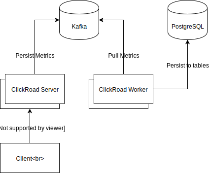

# ClickRoad Server

Lightweight application metrics collector.

[](https://circleci.com/gh/dialogs/clickroad-server)
[](https://codecov.io/gh/dialogs/clickroad-server)

## Installation

```bash
docker pull docker.pkg.github.com/dialogs/clickroad-server/clickroad-server:latest
```

[Docker Compose example](example/docker-compose.yml)

## Configuration

Image fully configurable using environment variables.

| Name              | Default        | Description                                                                                                                                                                                           |
| ----------------- | -------------- | ----------------------------------------------------------------------------------------------------------------------------------------------------------------------------------------------------- |
| REST_HOST         | 0.0.0.0        | REST (web) server listen port.                                                                                                                                                                        |
| REST_PORT         | 3000           | REST (web) server listen host.                                                                                                                                                                        |
| GRPC_HOST         | 0.0.0.0        | gRPC server listen host.                                                                                                                                                                              |
| GRPC_PORT         | 3001           | gRPC server listen port.                                                                                                                                                                              |
| MODE              | all           | `rest-server` - starts the metrics producer REST server. `grpc-server` - starts the metrics producer gRPC server. `all` - starts all services in the single process, _not recommended in production_. |
| KAFKA_TOPIC       | metrics        | Kafka topic name.                                                                                                                                                                                     |
| KAFKA_GROUP_ID    | clickroad      | Kafka consumer group id.                                                                                                                                                                              |
| KAFKA_CLIENT_ID   | clickroad      | Kafka client id.                                                                                                                                                                                      |
| KAFKA_BROKER_LIST | localhost:9092 | Kafka comma delimited broker list.                                                                                                                                                                    |

### High Level Architecture



## Development

If you're using macOS paste this before installation:

```bash
export CPPFLAGS=-I/usr/local/opt/openssl/include
export LDFLAGS=-L/usr/local/opt/openssl/lib
```

## License

[Apache-2.0](LICENSE)
